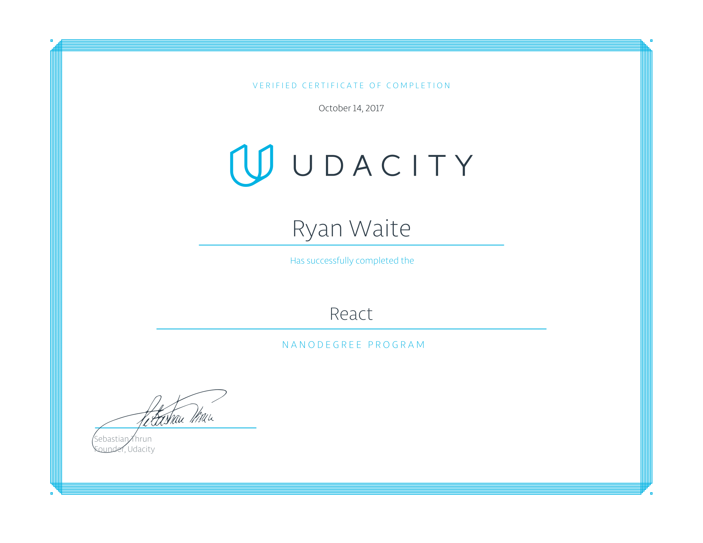

# UDACITY
### React Developer Nanodegree
##### Alumni/Graduate

https://www.udacity.com/course/react-nanodegree--nd019

> React is a powerful JavaScript library ideal for building interactive, data-driven user interfaces, and it’s used by some of the most successful brands in the world, including Facebook, Netflix, Airbnb, and more.  
In this Nanodegree program, you'll learn how to build declarative user interfaces for the web with React, and for iOS and Android with React Native. You'll also learn how to manage state more predictably in your applications with Redux.  
\- Udacity

This was a fun journey! I started this program in July 2017. I honestly think that React is better than Angular because of its Component based  methodology! I love Angular but React takes the cake. The 3 project from this course are below.
 

* P1: React Fundamentals - https://github.com/ryanwaite28/react-myreads
* P2: React and Redux - https://github.com/ryanwaite28/react-readable
* P3: React Native - https://github.com/ryanwaite28/react_native-flashcards
